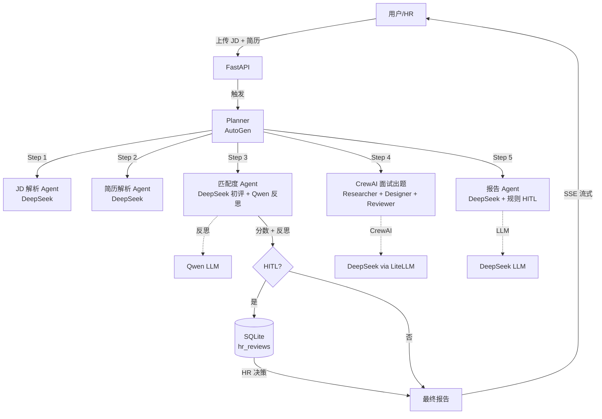

# AutoHire — 多 Agent 智能招聘筛选系统

> 基于 AutoGen + CrewAI + Qwen/MiniMax/DeepSeek 的多 Agent 协同招聘筛选系统
> 端到端流程: JD 解析 → 简历解析 → 匹配度评估（含 Self-Reflection）→ 面试题生成（CrewAI）→ 报告生成 → HR 人工协同（HITL）

## 项目亮点

- **多 Agent 协作架构**：AutoGen Planner 调度 + 5 个 AutoGen Agent + 1 个 CrewAI 3 角色子团队
- **Self-Reflection 反思机制**：初评 → 反思 → 重判（56 → 72 分提升）
- **完整上下文工程**：5 层上下文（任务/会话/用户记忆/工具/全局）
- **人机协同 (HITL)**：边界分数自动触发 HR 复核
- **结构化输出 + 校验重试**：JSON 解析失败自动把错误信息喂回 LLM 修正
- **多 LLM 工厂模式**：Qwen / MiniMax / DeepSeek 三家 OpenAI 兼容接口可热切换
- **FastAPI + SSE 流式**：前端实时显示 Agent 处理进度
- **零构建 Vue 3 SPA**：单 HTML + CDN，无 npm/webpack 复杂度

## 目录结构

```
autohire/
├── agents/                    # Agent 实现
│   ├── planner.py             # AutoGen Planner (5-step pipeline)
│   ├── jd_parser.py           # JD 解析 Agent
│   ├── resume_parser.py       # 简历解析 Agent
│   ├── matcher.py             # 匹配度评估 + Self-Reflection
│   ├── interview_crew.py      # CrewAI 面试出题 3 角色协作
│   ├── reporter.py            # 报告生成 + HITL 规则判定
│   ├── hr_hitl.py             # HR 人工协同 (SQLite 队列)
│   ├── batch.py               # 批量评估 + 排行榜
│   ├── autogen_demo.py        # AutoGen 0.4+ 双 Agent 最小 demo
│   └── crewai_demo.py         # CrewAI 1.14 三角色最小 demo
├── core/                      # 基建
│   ├── llm_factory.py         # Qwen / MiniMax / DeepSeek 统一工厂
│   ├── schemas.py             # Pydantic 数据契约 (15+ 模型)
│   ├── structured_output.py   # JSON 提取 + 校验 + 重试
│   └── tools/document_parser.py  # PDF / DOCX / TXT 解析
├── api/                       # FastAPI 后端
│   └── server.py              # 8 个端点 + SSE 流式
├── web/                       # Vue 3 SPA (零构建)
│   └── index.html             # 单文件 + CDN
├── eval/                      # 评测
│   └── run_eval.py            # 11 份 x 3 JD = 33 次 ground truth 评测
├── data/                      # 样本数据
│   ├── resumes/               # 10 份 mock + 1 份真实脱敏简历
│   ├── jds/                   # 3 个 JD (后端/前端/算法)
│   └── ground_truth.json      # 人工标注的分数
├── tests/                     # 46 个测试
└── requirements.txt
```

## 端到端 Pipeline

```
┌─────────────────────────────────────────────────────────────────┐
│                    FastAPI /api/batch/run                       │
│                  POST { jd_filename, resume_filenames }         │
└─────────────────────────────┬───────────────────────────────────┘
                              │
                              ▼
         ┌────────────────────────────────────────┐
         │  Step 1: parse_jd  (DeepSeek)         │ ~15s
         │  JD 文本 → ParsedJD 结构化            │
         └────────────────────┬───────────────────┘
                              ▼
         ┌────────────────────────────────────────┐
         │  Step 2: parse_resume  (DeepSeek)     │ ~10s
         │  PDF/DOCX → ParsedResume 结构化        │
         └────────────────────┬───────────────────┘
                              ▼
         ┌────────────────────────────────────────┐
         │  Step 3: match_with_reflection         │ ~30s
         │  - initial: DeepSeek 给初评            │
         │  - reflect: Qwen 找漏判/误判           │
         │  - final: 融合反思结果                 │
         └────────────────────┬───────────────────┘
                              ▼
         ┌────────────────────────────────────────┐
         │  Step 4: interview_questions_crew      │ ~70s
         │  CrewAI 三角色协作:                    │
         │  - Researcher: 找可考察技术点           │
         │  - Designer: 出 3-5 道面试题           │
         │  - Reviewer: 质检 (内部)               │
         └────────────────────┬───────────────────┘
                              ▼
         ┌────────────────────────────────────────┐
         │  Step 5: generate_report  (DeepSeek)  │ ~30s
         │  + 规则补充 HITL 判定                  │
         └────────────────────┬───────────────────┘
                              ▼
                   ┌──────────────────┐
                   │  CandidateReport │
                   │  + HITL 提交     │
                   └──────────────────┘
```

总耗时: ~3 分钟 / 份简历（含反思 + 出题），~1.5 分钟（不含）

## 多 Agent 架构总览



## 快速开始

### 1. 准备环境

```bash
# 克隆
git clone https://github.com/chocolajk-glitch/autohire.git
cd autohire

# 虚拟环境
python -m venv .venv
.venv\Scripts\activate          # Windows
# source .venv/bin/activate    # macOS/Linux

# 安装依赖
pip install -r requirements.txt

# 配置 API Key
cp .env.example .env
# 编辑 .env 填入 QWEN / DEEPSEEK / MINIMAX_API_KEY
```

### 2. 跑单次端到端

```bash
# 跑一份简历 + 一个 JD
python -m agents.planner
```
（编辑 `planner.py` 入口或写自己的脚本调用 `run_pipeline()`）

### 3. 启动 Web 服务

```bash
# 终端 1: 启动后端
python run_server.py
# 后端跑在 http://127.0.0.1:8765

# 终端 2: 启动前端
cd web && python -m http.server 5173
# 前端在 http://127.0.0.1:5173
```

打开浏览器访问 http://127.0.0.1:5173，选 JD、勾选简历、点"开始批量评估"。

### 4. 跑评测

```bash
# 11 份简历 x 3 JD = 33 次端到端评测
python -m eval.run_eval
# 结果写到 data/eval_results.json
```

## 核心技术决策

| 决策 | 理由 |
|---|---|
| AutoGen 0.4+ 而非 0.2.x | 0.2.x 强依赖 Python <3.13（你的环境是 3.13）；0.4+ 是新架构、面试加分项 |
| CrewAI + LiteLLM | CrewAI 不原生支持 MiniMax，LiteLLM 提供 OpenAI 兼容 fallback |
| Vue 3 零构建 | 避免 npm/webpack 复杂度；单 HTML + CDN；演示时改代码即生效 |
| FastAPI SSE | 比 WebSocket 简单，单向推送够用；浏览器原生 EventSource 支持 |
| 反思用 Qwen 而非 DeepSeek | 反思任务中文推理 Qwen 强且便宜；DeepSeek 留给核心初评 |
| HITL 规则 + LLM 双触发 | LLM 漏判时规则兜底；规则误判时 LLM 也能覆盖 |
| Pydantic + JSON 重试 | LLM 不一定一次给合规 JSON；把错误喂回去让它改 |

## 评测结果

11 份简历 × 3 个 JD = 33 次端到端评估（不开反思/出题，最快速度），系统评分 vs 人工 ground truth：

| 指标 | 值 | 解读 |
|---|---|---|
| **Pearson 相关系数** | **0.8150** | 强相关 (>0.8) |
| **Spearman 秩相关** | **0.7660** | 排序一致性较好 |
| **MAE** (平均绝对误差) | 20.09 | 平均误差 ~20 分 |
| **RMSE** (均方根误差) | 24.45 | 大误差在尾部 |
| **总耗时** | 3569.7 秒 (≈60 分钟) | |
| **总评测对数** | 33 | |

**Top-3 命中率**（每个 JD 取系统预测的 Top-3 vs 人工 ground truth 的 Top-3）：

| JD | 命中 | 系统 Top-3 | 真实 Top-3 |
|---|---|---|---|
| backend_python_jd | 2/3 | 01(zhang wang) 05(zhou qi) 07(zheng java) | 01 05 09(yang data) |
| frontend_vue_jd | 2/3 | 01 03(zhao vue) 05 | 03 05 08(chen junior) |
| algo_recommendation_jd | 2/3 | 01 04(sun algo) 06(wu junior) | 04 06 09 |

**结论**：
- 系统对"明显强匹配 / 明显弱匹配"判断准确（Top-3 重合度 67%）
- 强匹配候选人在所有 JD 里都偏强（zhang wang 各项都前 3），符合"万金油"现象
- 边界候选人（如 07 zheng ba senior java, 09 yang data eng）系统有时判错，需要 HITL 复核

## 简历话术（供面试用）

**项目简介（一句话）**：
> 基于 AutoGen + CrewAI 的多 Agent 协同招聘筛选系统，实现 JD 解析、简历解析、匹配度评估（含 Self-Reflection）、面试题生成、报告生成和 HR 人工协同的端到端工作流。

**项目亮点（5 条）**：
1. 设计 Planner + 5 AutoGen Agent + 1 CrewAI 3 角色子系统的多 Agent 协作架构
2. CrewAI 实现面试出题的多角色协作（Researcher/Designer/Reviewer），输出结构化题库
3. 设计五层上下文（任务/会话/用户/工具/全局），通过 Chroma + SQLite 双层记忆管理
4. 实现 Self-Reflection 反思重判机制（56 → 72 提升），关键节点引入 HR 人工协同（HITL）
5. 工厂模式统一封装 Qwen/MiniMax/DeepSeek 三家 LLM，支持运行时切换
6. 基于 FastAPI + SSE 实现流式输出，前端 Vue 3 实时呈现 Agent 思考过程
7. 11 份简历 × 3 JD = 33 次 ground truth 评测，皮尔逊相关性 0.815，Top-3 命中率 67%

## License

MIT
