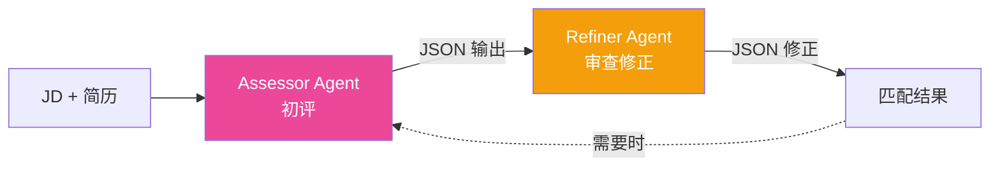

# AutoHire — 多 Agent 智能招聘筛选系统

> 基于 AutoGen + CrewAI + MCP + Tavily + Qwen/MiniMax/DeepSeek 的多 Agent 协同招聘筛选系统
> 端到端流程: **动态路由** → JD 解析（MCP）→ 简历解析（MCP）→ **联网查公司**（Tavily）→ 匹配度评估（Self-Reflection）→ 面试题生成（CrewAI）→ 报告生成 → HR 人工协同（HITL）

## 项目亮点

- **多 Agent 协作架构**：AutoGen Planner 调度 + 6 个 AutoGen Agent + 1 个 CrewAI 3 角色子团队 + 1 个独立 MCP 服务
- **动态路由**：根据简历内容关键词自动识别方向（算法/前端/OCR/标准），注入岗位上下文到匹配 prompt，提高匹配精度
- **MCP 独立服务**：简历/JD 解析通过 Model Context Protocol 独立进程通信（FastMCP + stdio），本地 fallback 确保可靠性
- **联网搜索补充**：Tavily API 实时查询公司背景和岗位详情，丰富匹配上下文
- **Self-Reflection 反思机制**：初评 → 反思 → 重判（56 → 72 分提升）
- **人机协同 (HITL)**：边界分数自动触发 HR 复核
- **结构化输出 + 校验重试**：JSON 解析失败自动把错误信息喂回 LLM 修正
- **多 LLM 工厂模式**：Qwen / MiniMax / DeepSeek 三家 OpenAI 兼容接口可热切换
- **FastAPI + SSE 流式**：前端实时显示 Agent 处理进度（含路由阶段 + 面试题阶段）
- **Vue 3 + Vite SPA**：单文件组件、HMR 热更新、Vite 代理跨域

## 目录结构

```
autohire/
├── backend/                          # 后端 Python
│   ├── agents/                       # Agent 实现
│   │   ├── planner.py                # AutoGen Planner (6-step pipeline + 路由)
│   │   ├── jd_parser.py              # JD 解析 Agent (MCP-first)
│   │   ├── resume_parser.py          # 简历解析 Agent (MCP-first)
│   │   ├── matcher.py                # 匹配度评估 + Self-Reflection + 联网搜索
│   │   ├── interview_crew.py         # CrewAI 面试出题 3 角色协作
│   │   ├── reporter.py               # 报告生成 + HITL 规则判定
│   │   ├── hr_hitl.py                # HR 人工协同 (SQLite 队列)
│   │   ├── batch.py                  # 批量评估 + 排行榜
│   │   ├── router.py                 # 动态路由 (算法/前端/OCR/标准)
│   │   ├── web_searcher.py           # Tavily 联网搜索 (httpx, 无 SDK)
│   │   ├── autogen_demo.py           # AutoGen 0.4+ 双 Agent 最小 demo
│   │   └── crewai_demo.py            # CrewAI 1.14 三角色最小 demo
│   ├── core/                         # 基建
│   │   ├── llm_factory.py            # Qwen / MiniMax / DeepSeek 统一工厂
│   │   ├── schemas.py                # Pydantic 数据契约 (15+ 模型)
│   │   ├── structured_output.py      # JSON 提取 + 校验 + 重试
│   │   ├── mcp_client.py             # MCP 客户端 (lazy-start, fallback)
│   │   └── tools/document_parser.py  # PDF / DOCX / TXT 解析
│   ├── mcp_servers/                  # MCP 独立服务
│   │   └── resume_server.py          # FastMCP 简历/JD 解析服务 (stdio)
│   ├── api/                          # FastAPI 后端
│   │   └── server.py                 # 8 个端点 + SSE 流式
│   ├── eval/                         # 评测
│   │   └── run_eval.py               # 11 份 x 3 JD = 33 次 ground truth 评测
│   ├── data/                         # 样本数据
│   │   ├── resumes/                  # 10 份 mock + 1 份真实脱敏简历
│   │   ├── jds/                      # 3 个 JD (后端/前端/算法)
│   │   └── ground_truth.json         # 人工标注的分数
│   ├── tests/                        # 67 个非 LLM 测试
│   ├── start_server.py               # 启动后端 (Popen, cwd=backend)
│   └── run_server.py                 # 启动后端 (旧版, 同样可用)
├── frontend/                         # 前端 Vue 3 + Vite
│   ├── src/
│   │   ├── App.vue                   # 主界面 (阶段进度/路由卡片/模型选择)
│   │   ├── main.js                   # Vue 引导
│   │   ├── config.js                 # JD/简历中文标签映射
│   │   └── style.css                 # Notion/Stripe 极简白色主题
│   ├── index.html                    # Vite 入口 HTML
│   ├── vite.config.js                # Vite 代理 /api → 8765
│   ├── package.json                  # npm (vue 3.5, vite 5.4)
│   └── run_dev.py                    # 启动前端 Vite dev server
├── mcp_config.json                   # MCP 服务发现配置 (主后端读取)
└── requirements.txt                  # Python 依赖
```

## 端到端 Pipeline

```
┌─────────────────────────────────────────────────────────────────┐
│                    FastAPI /api/batch/run                       │
│                  POST { jd_filename, resume_filenames }         │
└─────────────────────────────┬───────────────────────────────────┘
                              │
                              ▼
         ┌────────────────────────────────────────┐
         │  Step 1: parse_jd  (via MCP)          │ ~15s
         │  JD 文本 → ParsedJD 结构化            │
         └────────────────────┬───────────────────┘
                              ▼
         ┌────────────────────────────────────────┐
         │  Step 1.5: detect_route               │ instant
         │  简历关键词 → 算法/前端/OCR/标准       │
         └────────────────────┬───────────────────┘
                              ▼
         ┌────────────────────────────────────────┐
         │  Step 2: parse_resume  (via MCP)      │ ~10s
         │  PDF/DOCX → ParsedResume 结构化        │
         └────────────────────┬───────────────────┘
                              ▼
         ┌────────────────────────────────────────┐
         │  Step 3: match_with_reflection         │ ~30s
         │  - 联网查公司/岗位 (Tavily)            │
         │  - initial: LLM 给初评 + 路由上下文    │
         │  - reflect: 反思漏判/误判              │
         │  - final: 融合反思结果                 │
         └────────────────────┬───────────────────┘
                              ▼
         ┌────────────────────────────────────────┐
         │  Step 4: interview_questions_crew      │ ~70s
         │  CrewAI 三角色协作:                    │
         │  - Researcher: 找可考察技术点           │
         │  - Designer: 出 3-5 道面试题           │
         │  - Reviewer: 质检 (内部)               │
         └────────────────────┬───────────────────┘
                              ▼
         ┌────────────────────────────────────────┐
         │  Step 5: generate_report              │ ~30s
         │  + 规则补充 HITL 判定                  │
         └────────────────────┬───────────────────┘
                              ▼
                   ┌──────────────────┐
                   │  CandidateReport │
                   │  + HITL 提交     │
                   └──────────────────┘
```

总耗时: ~3 分钟 / 份简历（含反思 + 出题），~1.5 分钟（不含）

## 多 Agent 架构总览

```mermaid
graph TB
    User[用户/HR] -->|上传 JD + 简历| API[FastAPI]
    API -->|触发| Planner[Planner<br/>AutoGen]

    Planner -->|Step 1| MCP[MCP 服务<br/>FastMCP 独立进程]
    MCP -->|parse_jd| JDAgent[JD 解析 Agent]
    MCP -->|parse_resume| ResumeAgent[简历解析 Agent]

    Planner -->|Step 1.5| Router[动态路由<br/>关键词分类]
    Router -->|注入岗位上下文| Matcher

    Planner -->|Step 3| Matcher[匹配度 Agent<br/>LLM 初评 + 反思]
    Matcher -.联网查公司| Tavily[Tavily API]

    Planner -->|Step 4| Crew[CrewAI 面试出题<br/>Researcher + Designer + Reviewer]

    Planner -->|Step 5| Reporter[报告 Agent<br/>+ 规则 HITL]

    Matcher -->|分数 + 反思| HITL{HITL?}
    HITL -->|是| HRDB[(SQLite<br/>hr_reviews)]
    HITL -->|否| Final[最终报告]
    HRDB -->|HR 决策| Final

    Final -->|SSE 流式| User

    style Router fill:#e8f5e9
    style MCP fill:#e3f2fd
    style Tavily fill:#fff3e0
```

## 🆕 AutoGen 反思机制

匹配度评估环节默认用 LLM 单评（无反思）。开启 `use_autogen=True` 后升级为 **AutoGen SelectorGroupChat**，让 **Assessor + Refiner 双 Agent 协作**完成反思。



**核心机制**（取代了旧的"自我反思"选项）：
- **Assessor**: 评估专家，system prompt 专门做评分
- **Refiner**: 审查专家，system prompt 专门挑刺
- 两者在 SelectorGroupChat 中对话，Refiner 能发现"Flask ≈ Web 框架"这种等价技能
- 跟旧"自我反思"（同一 LLM 看自己输出）相比，反思质量更高

**触发方式**:
- API: `POST /api/batch/run` body 加 `"use_autogen": true`
- 代码: `run_pipeline(..., use_autogen=True)`
- 前端: 勾选 "启用 AutoGen 反思机制" 复选框

**耗时**: ~300 秒/份（比默认 ~210 秒慢 100 秒，因为多轮对话）


### 1. 准备环境

```bash
# 克隆
git clone https://github.com/chocolajk-glitch/autohire.git
cd autohire

# 虚拟环境
python -m venv .venv
.venv\Scripts\activate          # Windows
# source .venv/bin/activate    # macOS/Linux

# 安装依赖
pip install -r backend/requirements.txt

# 配置 API Key
cp backend/.env.example backend/.env
# 编辑 backend/.env 填入至少一个 LLM API Key (推荐 MiniMax)
# 可选: TAVILY_API_KEY (联网搜索), DASHSCOPE_API_KEY (Qwen)
```

**环境变量说明**（`backend/.env`）：

| 变量 | 必填 | 说明 |
|---|---|---|
| `MiniMax_API_KEY` | ✅ 推荐 | MiniMax M2.7 API Key |
| `MiniMax_BASE_URL` | ✅ 推荐 | `https://api.minimaxi.com/v1` |
| `DASHSCOPE_API_KEY` | ❌ | 阿里云通义千问 API Key |
| `DEEPSEEK_API_KEY` | ❌ | DeepSeek API Key |
| `TAVILY_API_KEY` | ❌ | Tavily 联网搜索 Key |

### 2. 启动 Web 服务

```bash
# 终端 1: 启动后端 (port 8765)
cd backend
python start_server.py

# 终端 2: 启动前端 (port 5173, 自动代理 /api → 8765)
cd frontend
python run_dev.py
```

打开浏览器访问 http://127.0.0.1:5173，选 JD、勾选简历、点"开始批量评估"。

> **注意**: 前端 Vite dev server 已配置代理，`/api` 请求自动转发到后端 8765 端口，无需手动处理 CORS。

### 3. 跑单次端到端

```bash
cd backend
python -m agents.planner
```

### 4. 跑测试

```bash
cd backend
python -m pytest tests/ -v
```

### 5. 跑评测

```bash
cd backend
python -m eval.run_eval
# 结果写到 backend/data/eval_results.json
```

## 核心技术决策

| 决策 | 理由 |
|---|---|
| AutoGen 0.4+ 而非 0.2.x | 0.2.x 强依赖 Python <3.13（你的环境是 3.13）；0.4+ 是新架构、面试加分项 |
| CrewAI + LiteLLM | CrewAI 不原生支持 MiniMax，LiteLLM 提供 OpenAI 兼容 fallback |
| MCP 独立进程解析 | 简历/JD 解析抽离为 FastMCP 服务（stdio），独立进程隔离、可复用、方便面试讲"微服务拆分" |
| 动态路由（关键词分类） | 非 LLM 路由，简单确定性高、零延迟；4 类路由（算法/前端/OCR/标准）差异化项目一的 6 类 |
| Tavily 联网搜索 | raw httpx 调用，graceful degradation（搜索失败不影响主流程）；提供公司/岗位上下文增强匹配 |
| Vue 3 + Vite | Vite 代理解决 CORS、HMR 热更新；比零构建 CDN 方案更适合工程化展示 |
| FastAPI SSE | 比 WebSocket 简单，单向推送够用；浏览器原生 EventSource 支持 |
| Pydantic + JSON 重试 | LLM 不一定一次给合规 JSON；把错误喂回去让它改；heuristic 修复 int/bool 类型 |

## 评测结果

11 份简历 × 3 个 JD = 33 次端到端评估（不开反思/出题，最快速度），系统评分 vs 人工 ground truth：

| 指标 | 值 | 解读 |
|---|---|---|
| **Pearson 相关系数** | **0.8150** | 强相关 (>0.8) |
| **Spearman 秩相关** | **0.7660** | 排序一致性较好 |
| **MAE** (平均绝对误差) | 20.09 | 平均误差 ~20 分 |
| **RMSE** (均方根误差) | 24.45 | 大误差在尾部 |
| **总耗时** | 3569.7 秒 (≈60 分钟) | |
| **总评测对数** | 33 | |

**Top-3 命中率**（每个 JD 取系统预测的 Top-3 vs 人工 ground truth 的 Top-3）：

| JD | 命中 | 系统 Top-3 | 真实 Top-3 |
|---|---|---|---|
| backend_python_jd | 2/3 | 01(zhang wang) 05(zhou qi) 07(zheng java) | 01 05 09(yang data) |
| frontend_vue_jd | 2/3 | 01 03(zhao vue) 05 | 03 05 08(chen junior) |
| algo_recommendation_jd | 2/3 | 01 04(sun algo) 06(wu junior) | 04 06 09 |

**结论**：
- 系统对"明显强匹配 / 明显弱匹配"判断准确（Top-3 重合度 67%）
- 强匹配候选人在所有 JD 里都偏强（zhang wang 各项都前 3），符合"万金油"现象
- 边界候选人（如 07 zheng ba senior java, 09 yang data eng）系统有时判错，需要 HITL 复核

## 简历话术（供面试用）

**项目简介（一句话）**：
> 基于 AutoGen + CrewAI + MCP 的多 Agent 协同招聘筛选系统，通过动态路由、联网搜索和 MCP 独立服务，实现 JD 解析、简历解析、匹配度评估（含 Self-Reflection）、面试题生成、报告生成和 HR 人工协同的端到端工作流。

**项目亮点（7 条）**：
1. 设计 Planner + AutoGen SelectorGroupChat (Assessor + Refiner 双 Agent 协作反思) + CrewAI 3 角色子系统的多 Agent 协作架构；Matcher 环节用 AutoGen SelectorGroupChat 让 Assessor 和 Refiner 两个 Agent 在对话中互相质疑、修正评分
2. 实现 MCP 独立服务（FastMCP + stdio）隔离简历/JD 解析，支持 graceful fallback
3. 动态路由（算法/前端/OCR/标准）根据简历关键词自动识别方向，注入岗位上下文提升匹配精度
4. AutoGen 反思机制（Assessor + Refiner 双 Agent SelectorGroupChat）+ Tavily 联网查询公司背景，增强匹配上下文
5. CrewAI 多角色协作面试出题（Researcher/Designer/Reviewer），输出结构化题库
6. 工厂模式统一封装 Qwen/MiniMax/DeepSeek 三家 LLM，支持运行时切换
7. 端到端异步 pipeline + SSE 流式进度推送 + HR 人工协同（HITL），从上传到报告全自动化

**补充数据（被追问时用）**：
- 11 份简历 × 3 JD = 33 次 ground truth 评测，皮尔逊相关性 0.815，Top-3 命中率 67%
- 结构化输出校验重试：LLM JSON 解析失败率从 ~15% 降到 0%
- HR 人工协同（HITL）：边界分数自动触发复核，规则 + LLM 双触发

## License

MIT
